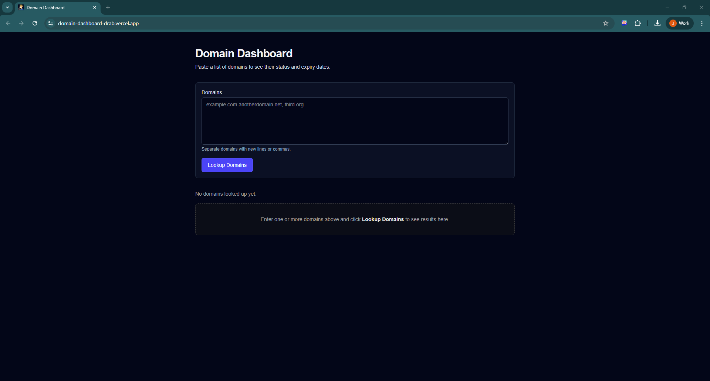
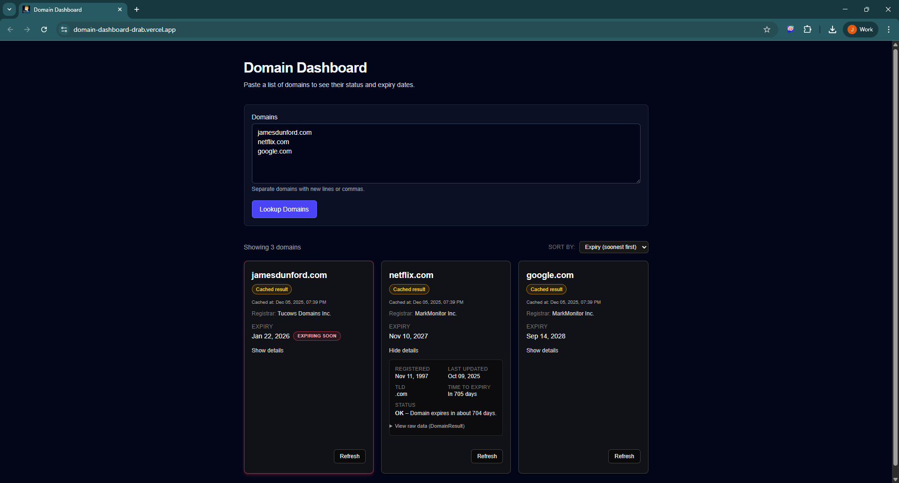
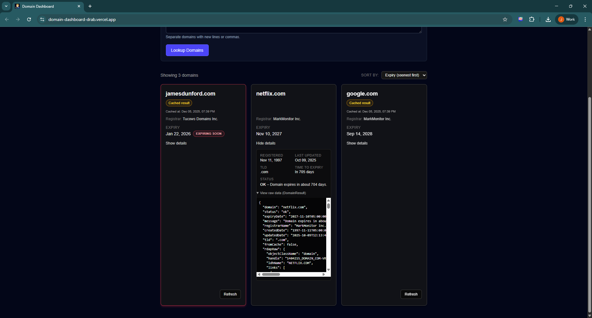

# Domain Dashboard — RDAP-Powered Domain Intelligence (Next.js 16)

[](https://domain-dashboard-drab.vercel.app/)


A modern **domain intelligence dashboard** built with **Next.js 16**, **React 19**, **TypeScript**, and **TailwindCSS**.  
It fetches, normalizes, and presents RDAP data for any domain — with caching, on-demand refresh, and clean expandable detail views.

This project demonstrates full-stack engineering, API design, typed data modeling, and production deployment.

---

## 📸 Screenshots

### 🟦 Start Screen (empty state)

<div style="display: flex; gap: 12px; margin-bottom: 20px;">
  
</div>

---

### 🟧 Lookup Results — Closed Cards (with expiring badge + search functionality)

<div style="display: flex; gap: 12px; margin-bottom: 20px;">
  
</div>

---

### 🟨 Expanded RDAP Details (shows caching + structured metadata)

<div style="display: flex; gap: 12px; margin-bottom: 20px;">
  
</div>

---

### 🟩 Expanded Details After Refresh (shows uncached result + raw DomainResult)

<div style="display: flex; gap: 12px; margin-bottom: 20px;">
  
</div>

---

## 🚀 Features

### 🔍 Multi-domain RDAP lookup
- Paste one or more domains into a single textarea.
- Supports new lines or comma-separated lists.
- Clear empty state: “No domains looked up yet” with guidance text.
- One click on **Lookup Domains** triggers lookups for all domains.

### 📊 Card-based results focused on expiry
- One card per domain, showing:
  - Domain name
  - Registrar
  - Expiry date
- Expiring domains are visually highlighted:
  - Red border around the card
  - **EXPIRING SOON** badge on the expiry date
- Summary line (e.g. “Showing 3 domains”) keeps users oriented.

### ↕ Sorting by expiry
- Sort dropdown (e.g. **Expiry (soonest first)**) lets users see the most urgent domains first.
- Sorting updates the card order without reloading the page.

### ⚡ Caching and per-domain refresh
- **Cached result** badge appears on cards when data came from cache.
- Cached timestamp (“Cached at: …”) shows when the data was last fetched.
- **Refresh** button on each card:
  - Forces a fresh RDAP lookup for that domain only.
  - Other cards stay visible and untouched.
  - After refresh, the cached badge updates/clears accordingly.

### 📂 Expandable details view
- **Show details / Hide details** toggle on each card.
- Expanded section includes key RDAP-derived fields such as:
  - Registration date
  - TLD
  - Last updated date
  - Status summary (e.g. “OK — Domain expires in about 704 days.”)
  - Time to expiry in days
- Optional **“View raw data (DomainResult)”** panel shows the full JSON object powering the UI.

### 🎨 Polished, production-ready UI
- Dark theme dashboard layout with a centered input panel.
- Consistent spacing, hierarchy, and typography.
- Responsive card layout that remains readable on larger screens.

---

## 🧪 How It Works

### 1️⃣ User enters domain(s)  
Input is cleaned, validated, and split.

### 2️⃣ API determines whether RDAP data is cached  
- If cached → serve cached version  
- If not → fetch from registry, parse, cache  

### 3️⃣ Results rendered as independent cards  
Per-domain refresh does not reset others.

---

## 📦 Tech Stack

| Layer | Technology |
|-------|------------|
| Framework | **Next.js 16 (App Router)** |
| UI | **React 19**, React Server Components |
| Styles | **TailwindCSS 4** |
| Language | **TypeScript 5** |
| API | Next.js Route Handlers |
| Deployment | Vercel |
| Data Source | Live RDAP registry endpoints |
| Caching | In-memory with timestamps |

---

## 🛠️ Running Locally

```bash
git clone https://github.com/YOUR-USERNAME/domain-dashboard.git
cd domain-dashboard
npm install
npm run dev
```
Then open http://localhost:3000

## 🔗 Live Demo

https://domain-dashboard-drab.vercel.app/

---
